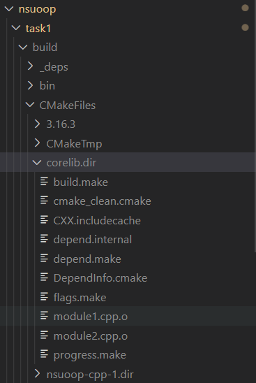
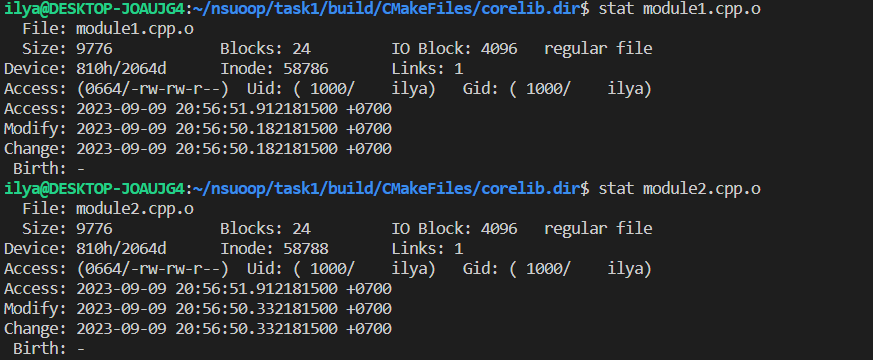
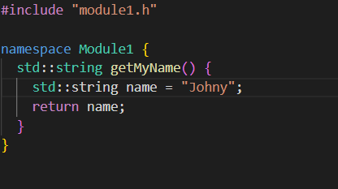
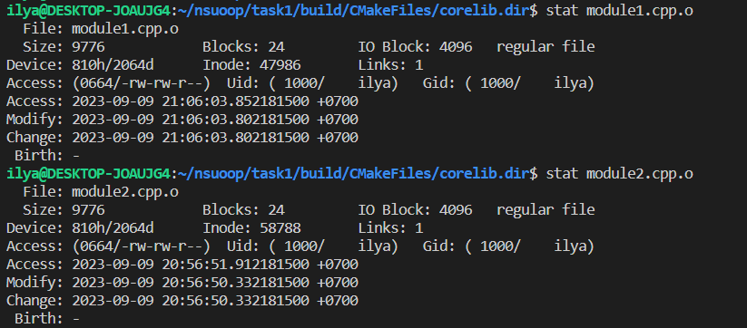
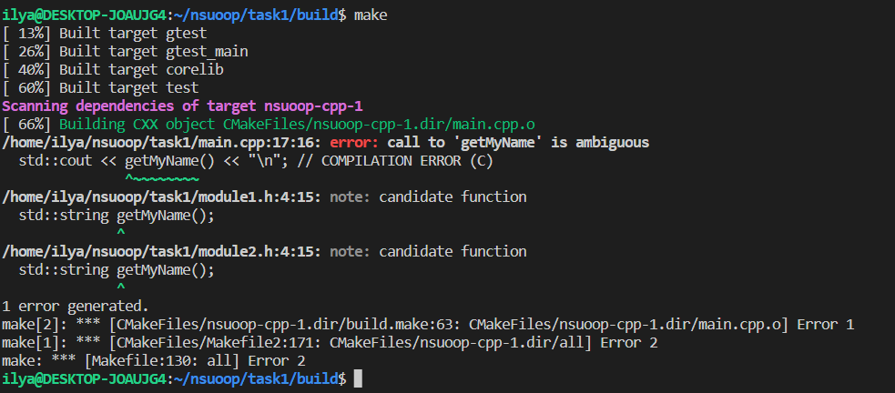
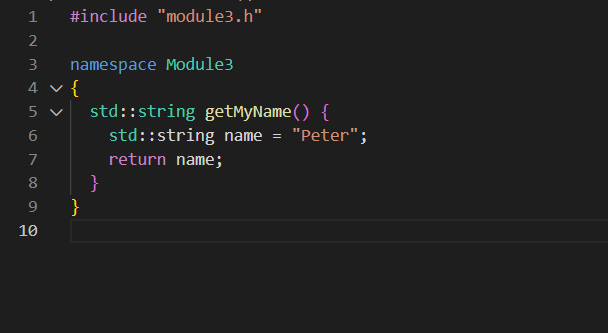

## Отчёт
>С тестовой программой нужно выполнить следующие действия: Собрать программу и убедиться, что на каждый _.cpp файл создается >отдельный объектный файл с тем же именем (для Visual Studio, например, в папке Debug будут создаваться файлы с расширением _.>obj).

>Убедиться, что при изменении одного *.cpp файла и пересборке проекта обновляется только соответствующий ему объектный файл >(дата изменения других объектных файлов останется прежней)
* До изменений.

* Поменял John на Johny

* Пересобрал

>Объяснить, что выведется при выполнении строк с комментариями (А) и (D) в main.cpp

* Произойдёт выполнения функции getMyName. В строке A из module1 (выведется John), так как мы используем пространство имён module1 (12 строка). В строке D из module2 (выведется James), так как мы прописали что использзуем getMyName из этого модуля (19 строка).

>Убедиться, что раскомментирование строк (B) и (C) в main.cpp приводит к ошибке компиляции. Объяснить, почему эта ошибка >происходит, и предложить пути её устранения.

* Происходит коллизия пространства имён module1 и module2, так как в каждом есть функция с таким именем.

* Можно не прописывать ___using namespace module2;___, а прописать ___using module2::getMyName;___ или при вызове ___Module2::getMyName()___.

>Добавить в программу еще одну функцию getMyName(), возвращающую имя Peter. Обернуть её в еще одно пространство имён.

>Объяснить, как можно избавиться от необходимости писать std::cout и вместо этого писать просто cout.

* Прописать ___using std::cout;___